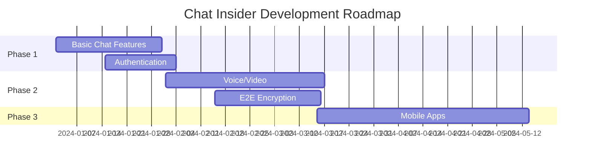

# Chat Insider 

```plaintext
   _______ __          __     ____              _     __          
  / ____(_) /_  ____ _/ /_   /  _/___  _______(_)___/ /__  _____
 / /   / / __ \/ __ `/ __/   / // __ \/ ___/ / / __  / _ \/ ___/
/ /___/ / / / / /_/ / /_   _/ // / / (__  ) / / /_/ /  __/ /    
\____/_/_/ /_/\__,_/\__/  /___/_/ /_/____/_/_/\__,_/\___/_/     
```

[](https://github.com/yourusername/chat-insider)
[](https://github.com/yourusername/chat-insider/blob/main/LICENSE)
[](https://nodejs.org/)
[](https://github.com/yourusername/chat-insider/pulls)

> A powerful real-time chat application built with modern technologies for seamless communication.

---

## 🌟 Features

```markdown
✨ Real-time Communication
📱 Responsive Design
🔐 Secure Authentication
💾 Message History
🔔 Push Notifications
🌓 Dark/Light Mode
📁 File Sharing
👥 Group Chats
🔍 Search Functionality
```

## 🛠️ Tech Stack

<details>
<summary>Frontend Technologies</summary>

```yml
- React.js + TypeScript
- Redux Toolkit
- Socket.io-client
- TailwindCSS
- Vite
```
</details>

<details>
<summary>Backend Technologies</summary>

```yml
- Node.js + Express
- Socket.io
- MongoDB
- Redis
- JWT Authentication
```
</details>

## ⚡ Quick Start

### Prerequisites

```bash
# Required installations
node >= 16.0.0
npm >= 8.0.0
mongodb >= 5.0.0
redis >= 6.0.0
```

### Installation Steps

1. **Clone the repository**

```bash
git clone https://github.com/yourusername/chat-insider.git
cd chat-insider
```

2. **Install dependencies**

```bash
# Backend dependencies
cd server
npm install

# Frontend dependencies
cd ../client
npm install
```

3. **Environment Setup**

```bash
# Server (.env)
PORT=5000
MONGODB_URI=your_mongodb_uri
JWT_SECRET=your_jwt_secret
REDIS_URL=your_redis_url

# Client (.env)
VITE_API_URL=http://localhost:5000
VITE_WS_URL=ws://localhost:5000
```

4. **Start Development Servers**

```bash
# Terminal 1 - Backend
cd server
npm run dev

# Terminal 2 - Frontend
cd client
npm run dev
```

## 🔧 Configuration

<details>
<summary>Available Scripts</summary>

```json
{
  "scripts": {
    "dev": "Start development server",
    "build": "Build for production",
    "start": "Start production server",
    "test": "Run tests",
    "lint": "Lint code",
    "format": "Format code"
  }
}
```
</details>

## 📝 API Documentation

### Authentication Endpoints

```http
POST /api/auth/register
POST /api/auth/login
GET  /api/auth/verify
POST /api/auth/refresh
```

### Chat Endpoints

```http
GET    /api/chats
POST   /api/chats
GET    /api/chats/:id
PUT    /api/chats/:id
DELETE /api/chats/:id
```

## 🧪 Testing

```bash
# Run all tests
npm test

# Run specific test suite
npm test -- --grep "Auth Tests"

# Run with coverage
npm test -- --coverage
```

## 🤝 Contributing

1. Fork the Project
2. Create your Feature Branch
```bash
git checkout -b feature/AmazingFeature
```
3. Commit your Changes
```bash
git commit -m 'Add some AmazingFeature'
```
4. Push to the Branch
```bash
git push origin feature/AmazingFeature
```
5. Open a Pull Request

## 📦 Project Structure

```plaintext
chat-insider/
├── client/
│   ├── src/
│   │   ├── components/
│   │   ├── pages/
│   │   ├── store/
│   │   └── utils/
│   ├── public/
│   └── package.json
├── server/
│   ├── src/
│   │   ├── controllers/
│   │   ├── models/
│   │   ├── routes/
│   │   └── utils/
│   └── package.json
└── README.md
```

## 📄 License

```plaintext
MIT License

Copyright (c) 2024 Chat Insider

Permission is hereby granted, free of charge, to any person obtaining a copy
of this software and associated documentation files (the "Software"), to deal
in the Software without restriction, including without limitation the rights
to use, copy, modify, merge, publish, distribute, sublicense, and/or sell
copies of the Software, and to permit persons to whom the Software is
furnished to do so, subject to the following conditions:

[...]
```

## 🎯 Roadmap



## 🤔 FAQ

<details>
<summary>How do I report a bug?</summary>

```markdown
1. Go to Issues tab
2. Click "New Issue"
3. Select "Bug Report"
4. Fill in the template
5. Submit
```
</details>

<details>
<summary>How can I request a feature?</summary>

```markdown
1. Go to Issues tab
2. Click "New Issue"
3. Select "Feature Request"
4. Fill in the template
5. Submit
```
</details>

## 📞 Support

```yml
Email: support@chatinsider.com
Discord: discord.gg/chatinsider
Documentation: docs.chatinsider.com
```

---

<div align="center">

**[Website](https://chatinsider.com)** • 
**[Documentation](https://docs.chatinsider.com)** • 
**[Report Bug](https://github.com/yourusername/chat-insider/issues)** • 
**[Request Feature](https://github.com/yourusername/chat-insider/issues)**

Made with ❤️ by Sajal Mahajan(https://github.com/sajalg364)

</div>
# Chat Application MERN-Stack Web Application.

<p align="center">
  <b style="color: blue;  ">Visitor count</b>
  <br>
  <a style="" href="https://github.com/akashdeep023">
  
  </a>
</p>

---

<a style="" href="https://chat-application-jack.vercel.app/">
  


</a>

---

## Project Overview

Chat Application 😊 using MERN Stack with Tailwind CSS

## Technologies & Packages Used

-   **MongoDB**: NoSQL database for flexible and scalable data storage.
-   **Express.js**: Web application framework for Node.js, providing robust features for web and mobile applications.
-   **Node.js**: JavaScript runtime for server-side development.
-   **React.js**: A JavaScript library for building reusable UI components and efficient single-page application views.
-   **Tailwind CSS**: A utility-first CSS framework for rapid UI development.
-   **Socket.IO**: Enables real-time, bidirectional and event-based communication.
-   **JWT (JSON Web Tokens)**: Securely transmits information between parties as a JSON object.
-   **Redux**: A Predictable State Container for JavaScript Apps.
-   **React-Toastify**: A JavaScript library for providing toast notifications in React.

## Key Features

-   **User Authentication:** SignIn, SignUp, and Logout functionality.
-   **Real-time Chat:** Users can send and receive messages in real-time.
-   **Group Chat:** Create and participate in group chats.
-   **Message Notifications:** Get notified of new messages with sound and visual alerts.
-   **State Management:** Manage application state efficiently using Redux.
-   **Responsive Design:** Tailwind CSS for a responsive and modern user interface.
<!-- -   **User Status:** Display online/offline status of users. -->

## How to Install

Follow these steps to set up and run the project locally:

1.  **Clone the Repository:**

    ```bash
    git clone https://github.com/akashdeep023/Chat_App.git
    cd Chat_App
    ```

2.  **Install Dependencies:**
    Frontend Folder :

    ```bash
    cd frontend
    npm install
    ```

    Backend Folder :

    ```bash
    cd backend
    npm install
    ```

3.  **Set Up Environment Variables:**

    Configure the following environment variables by creating a .env file in the root of Forntend and Backend Folder:

    Frontend Folder :

    ```bash
    VITE_BACKEND_URL=http://localhost:9000
    ```

    Backend Folder :

    ```bash
    FRONTEND_URL=http://localhost:5173
    MONGODB_URI=mongodb://127.0.0.1:27017/chat-app
    PORT=9000
    JWT_SECRET=secret-kvndkvdlkajkhkJkBiu6JJNjkbhkvnskcmhLJ5dKbkjsamnv
    ```

    Replace the values with your specific configurations.

4.  **Run the Application:**

    Frontend Folder :

    ```bash
    npm run dev
    ```

    Backend Folder :

    ```bash
    npm run dev
    ```

5.  **Open in Your Browser:**

Open `http://localhost:5173` in your web browser.

## Project Structure

    ├── frontend
    │   ├── public
    │   ├── src
    │   │   ├── assets
    │   │   ├── components
    │   │   ├── pages
    │   │   ├── redux
    │   │   ├── socket
    │   │   ├── utils
    │   │   ├── App.jsx
    │   │   ├── main.jsx
    │   │   └── index.css
    │   ├── index.html
    │   ├── tailwind.config.js
    │   ├── .env
    │   └── package.json
    ├── backend
    │   ├── config
    │   ├── controllers
    │   ├── middlewares
    │   ├── models
    │   ├── routes
    │   ├── server.js
    │   ├── .env
    │   └── package.json
    └── README.md

## Author

Akash Deep \
Email: contact.akashdeep023@gmail.com \
LinkedIn : https://www.linkedin.com/in/akashdeep023/

## Images
**Profile**


**Group Create**


**Chat & Group Overview**


**Chat & Group Members**


**Chat & Group Setting**


**Add User in Group (Admin Access)**


**Remove User in Group (Admin Access)**


**User Search & Chat**


**Notification Box**


**Notification Alert**


**Shimmer**


**Footer**


## Thank You

Thank you for exploring Chat App! Your feedback is valuable. If you have any suggestions or thoughts, feel free to share them with us. 😊

---
