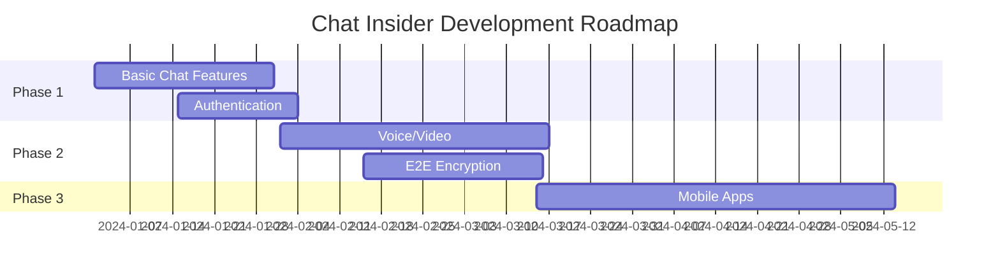

# Chat Insider 

```plaintext
   _______ __          __     ____              _     __          
  / ____(_) /_  ____ _/ /_   /  _/___  _______(_)___/ /__  _____
 / /   / / __ \/ __ `/ __/   / // __ \/ ___/ / / __  / _ \/ ___/
/ /___/ / / / / /_/ / /_   _/ // / / (__  ) / / /_/ /  __/ /    
\____/_/_/ /_/\__,_/\__/  /___/_/ /_/____/_/_/\__,_/\___/_/     
```

[](https://github.com/yourusername/chat-insider)
[](https://github.com/yourusername/chat-insider/blob/main/LICENSE)
[](https://nodejs.org/)
[](https://github.com/yourusername/chat-insider/pulls)

> A powerful real-time chat application built with modern technologies for seamless communication.

---

## 🌟 Features

```markdown
✨ Real-time Communication
📱 Responsive Design
🔐 Secure Authentication
💾 Message History
🔔 Push Notifications
🌓 Dark/Light Mode
📁 File Sharing
👥 Group Chats
🔍 Search Functionality
```

## 🛠️ Tech Stack

<details>
<summary>Frontend Technologies</summary>

```yml
- React.js + TypeScript
- Redux Toolkit
- Socket.io-client
- TailwindCSS
- Vite
```
</details>

<details>
<summary>Backend Technologies</summary>

```yml
- Node.js + Express
- Socket.io
- MongoDB
- Redis
- JWT Authentication
```
</details>

## ⚡ Quick Start

### Prerequisites

```bash
# Required installations
node >= 16.0.0
npm >= 8.0.0
mongodb >= 5.0.0
redis >= 6.0.0
```

### Installation Steps

1. **Clone the repository**

```bash
git clone https://github.com/yourusername/chat-insider.git
cd chat-insider
```

2. **Install dependencies**

```bash
# Backend dependencies
cd server
npm install

# Frontend dependencies
cd ../client
npm install
```

3. **Environment Setup**

```bash
# Server (.env)
PORT=5000
MONGODB_URI=your_mongodb_uri
JWT_SECRET=your_jwt_secret
REDIS_URL=your_redis_url

# Client (.env)
VITE_API_URL=http://localhost:5000
VITE_WS_URL=ws://localhost:5000
```

4. **Start Development Servers**

```bash
# Terminal 1 - Backend
cd server
npm run dev

# Terminal 2 - Frontend
cd client
npm run dev
```

## 🔧 Configuration

<details>
<summary>Available Scripts</summary>

```json
{
  "scripts": {
    "dev": "Start development server",
    "build": "Build for production",
    "start": "Start production server",
    "test": "Run tests",
    "lint": "Lint code",
    "format": "Format code"
  }
}
```
</details>

## 📝 API Documentation

### Authentication Endpoints

```http
POST /api/auth/register
POST /api/auth/login
GET  /api/auth/verify
POST /api/auth/refresh
```

### Chat Endpoints

```http
GET    /api/chats
POST   /api/chats
GET    /api/chats/:id
PUT    /api/chats/:id
DELETE /api/chats/:id
```

## 🧪 Testing

```bash
# Run all tests
npm test

# Run specific test suite
npm test -- --grep "Auth Tests"

# Run with coverage
npm test -- --coverage
```

## 🤝 Contributing

1. Fork the Project
2. Create your Feature Branch
```bash
git checkout -b feature/AmazingFeature
```
3. Commit your Changes
```bash
git commit -m 'Add some AmazingFeature'
```
4. Push to the Branch
```bash
git push origin feature/AmazingFeature
```
5. Open a Pull Request

## 📦 Project Structure

```plaintext
chat-insider/
├── client/
│   ├── src/
│   │   ├── components/
│   │   ├── pages/
│   │   ├── store/
│   │   └── utils/
│   ├── public/
│   └── package.json
├── server/
│   ├── src/
│   │   ├── controllers/
│   │   ├── models/
│   │   ├── routes/
│   │   └── utils/
│   └── package.json
└── README.md
```

## 📄 License

```plaintext
MIT License

Copyright (c) 2024 Chat Insider

Permission is hereby granted, free of charge, to any person obtaining a copy
of this software and associated documentation files (the "Software"), to deal
in the Software without restriction, including without limitation the rights
to use, copy, modify, merge, publish, distribute, sublicense, and/or sell
copies of the Software, and to permit persons to whom the Software is
furnished to do so, subject to the following conditions:

[...]
```

## 🎯 Roadmap



## 🤔 FAQ

<details>
<summary>How do I report a bug?</summary>

```markdown
1. Go to Issues tab
2. Click "New Issue"
3. Select "Bug Report"
4. Fill in the template
5. Submit
```
</details>

<details>
<summary>How can I request a feature?</summary>

```markdown
1. Go to Issues tab
2. Click "New Issue"
3. Select "Feature Request"
4. Fill in the template
5. Submit
```
</details>

## 📞 Support

```yml
Email: support@chatinsider.com
Discord: discord.gg/chatinsider
Documentation: docs.chatinsider.com
```

---

<div align="center">

**[Website](https://chatinsider.com)** • 
**[Documentation](https://docs.chatinsider.com)** • 
**[Report Bug](https://github.com/yourusername/chat-insider/issues)** • 
**[Request Feature](https://github.com/yourusername/chat-insider/issues)**

Made with ❤️ by Sajal Mahajan(https://github.com/sajalg364)

</div>
